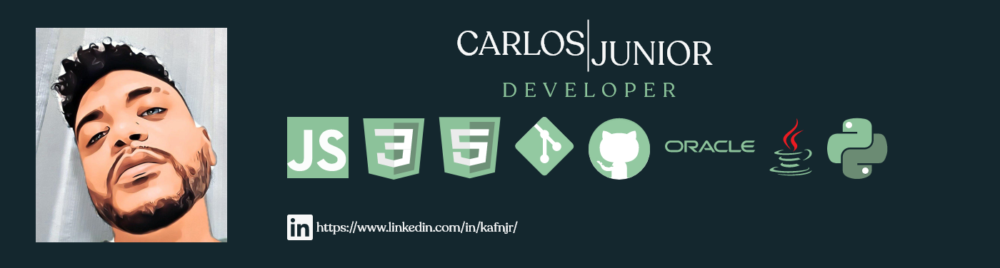

Olá, me chamo Carlos Junior, atualmente trabalho como DBA Oracle, estudo e sou apaixonado por front-end, também estudo JS, Python e Java.

Sejam bem-vindos ao meu github, onde eu compartilho o que estou estudando e o meu portifólio.

Ainda estou trabalhando neste perfil, então sejam pacientes (rsrsrs) e aguardem que em breve trarei novidades e links de projetos recém concluídos e outros que serão retomados. O primeiro passo, que é a criação deste perfil, já foi dado.

Redes sociais: 

Cards feito por: [Anurag Hazra](https://github.com/anuraghazra)

<!--
### Hi there 👋
**kafnjr/kafnjr** is a ✨ _special_ ✨ repository because its `README.md` (this file) appears on your GitHub profile.

Here are some ideas to get you started:

- 🔭 I’m currently working on ...
- 🌱 I’m currently learning ...
- 👯 I’m looking to collaborate on ...
- 🤔 I’m looking for help with ...
- 💬 Ask me about ...
- 📫 How to reach me: ...
- 😄 Pronouns: ...
- ⚡ Fun fact: ...
-->
